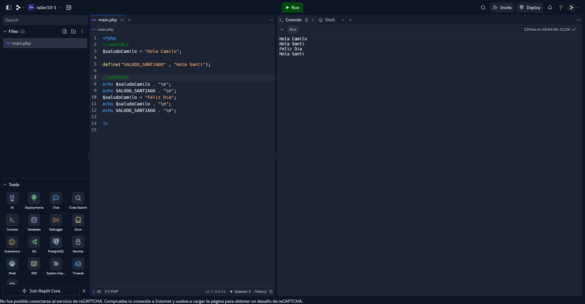

<h1>Taller 10 - Camilo Andrés Mora Acosta</h1>

<h2>Información</h2>

Curso: Full Stack Básico - Grupo 1

Profesor: Cristian Patiño

<h2>Punto 1: Constantes y variables</h2>

<h2>Punto 2: Suma de Constantes y variables</h2>

<h2>Punto 3: Suma de Dos Numeros Indicados por el Usuario</h2>

<h2>Punto 4: Datos del Usuario en Consola</h2>

<h2>Punto 5: Entrada de Bolera Usando if / else</h2>

<h2>Punto 6: Deteccion de Mayoria de Edad</h2>

<h2>Punto 7: Seleccion de Operacion Aritmetica</h2>

<h2>Punto 8: Entrada de Bolera Usando Switch</h2>

<h2>Punto 9: Tabla de Multiplicar Usando While</h2>

<h2>Punto 10: Numeros Pares Usando While</h2>

<h2>Punto 11: Numeros Impares Usando For</h2>

<h2>Punto 12: Tablas de Multiplicar Usando For</h2>

<h2>Punto 13: Suma de Valores de un Arreglo Usando Foreach</h2>

<h2>Punto 14: Revision de Contraseña</h2>

<h2>Punto 15: Seleccion de Operacion Aritmetica Usando Funciones</h2> 